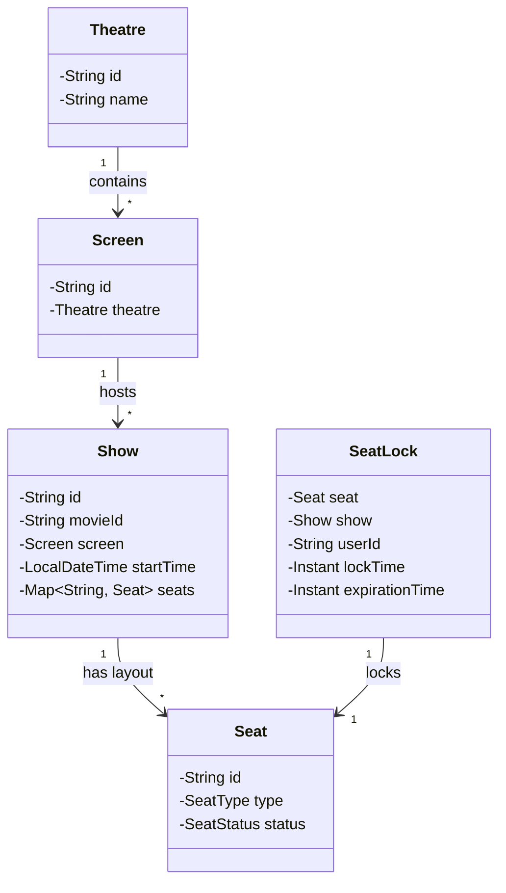
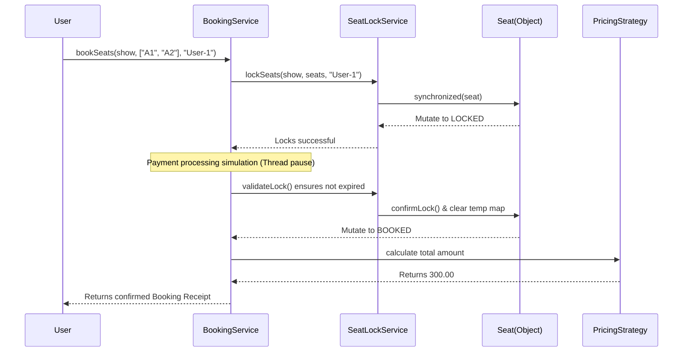

# 🎬 Comprehensive Technical Report: Movie Ticket Booking System (LLD)

## 1. Executive Summary
This document provides a highly detailed Low-Level Design (LLD) breakdown of the **Movie Ticket Booking System**. It is built in pure Java without external frameworks (like Spring) or databases, focusing entirely on object-oriented programming (OOP) principles, design patterns, internal memory management, thread safety, and scalable concurrency.

The project fulfills several critical enterprise requirements:
- **Seat Locking Mechanism**: Temporarily reserving seats to prevent double-booking.
- **Time-based Lock Expiration**: Background eviction of stale locks.
- **Concurrent Booking Simulation**: Thread-safe operations allowing high-throughput ticketing.
- **Dynamic Pricing Rules**: Scalable pricing strategies.

---

## 2. Core Architecture & Domain Entities

The system relies on a rich domain model encapsulating properties and strict behaviors. 

### 2.1 Entity Details

* **[Theatre](file:///e:/Projects/MovieTicketBookingSystem/src/model/Theatre.java#3-20)**: The physical establishment housing multiple screens.
  * Properties: [id](file:///e:/Projects/MovieTicketBookingSystem/src/service/SeatLockService.java#73-81), `name`.
* **[Screen](file:///e:/Projects/MovieTicketBookingSystem/src/model/Screen.java#3-20)**: An auditorium within a Theatre.
  * Properties: [id](file:///e:/Projects/MovieTicketBookingSystem/src/service/SeatLockService.java#73-81), `theatre`.
* **[Show](file:///e:/Projects/MovieTicketBookingSystem/src/model/Show.java#7-49)**: Represents a screening of a Movie at a specific time. 
  * Properties: [id](file:///e:/Projects/MovieTicketBookingSystem/src/service/SeatLockService.java#73-81), `movieId`, `screen`, `startTime`, `Map<String, Seat> seats`.
  * **Design Choice**: The `seats` map is a `ConcurrentHashMap`. This maps seat IDs to [Seat](file:///e:/Projects/MovieTicketBookingSystem/src/model/Seat.java#3-30) objects. Placing the layout map inside the [Show](file:///e:/Projects/MovieTicketBookingSystem/src/model/Show.java#7-49) instance ensures that locks and accesses for *Movie A at 10 AM* have absolutely zero CPU contention with *Movie B at 12 PM*.
* **[Seat](file:///e:/Projects/MovieTicketBookingSystem/src/model/Seat.java#3-30)**: The individual units being booked.
  * Properties: [id](file:///e:/Projects/MovieTicketBookingSystem/src/service/SeatLockService.java#73-81), `type` (Enum: VIP, REGULAR, PREMIUM), `status` (Enum: AVAILABLE, LOCKED, BOOKED).
* **[SeatLock](file:///e:/Projects/MovieTicketBookingSystem/src/model/SeatLock.java#5-36)**: A temporal mapping object recording a reservation attempt.
  * Properties: `seat`, `show`, `userId`, `lockTime`, `expirationTime` (Instant).
* **[Booking](file:///e:/Projects/MovieTicketBookingSystem/src/model/Booking.java#5-40)**: The final receipt object representing confirmed payment and ownership.
  * Properties: `bookingId`, `userId`, `show`, `List<Seat> seats`, `amountPaid`.

### 2.2 Entity Class Diagram



---

## 3. Advanced Engineering Mechanics

### 3.1 Concurrency & Double-Booking Prevention (The Core Challenge)
The biggest risk in a ticketing system is two users booking the identical seat at the identical millisecond. 
If we use a method-level `synchronized` block on [bookSeat()](file:///e:/Projects/MovieTicketBookingSystem/src/service/BookingService.java#25-74), it forces single-file lines for *all users*, crippling the application's throughput. 

Instead, we use **Granular Monitor Locks**:
```java
private void lockSeat(Show show, Seat seat, String userId, int timeoutInSeconds) {
    synchronized (seat) {
        if (seat.getStatus() == SeatStatus.AVAILABLE) {
            seat.setStatus(SeatStatus.LOCKED);
            SeatLock lock = new SeatLock(seat, show, userId, timeoutInSeconds);
            locks.computeIfAbsent(show.getId(), k -> new ConcurrentHashMap<>()).put(seat.getId(), lock);
        } else {
            throw new SeatLockException("Seat " + seat.getId() + " is already " + seat.getStatus());
        }
    }
}
```
**Why this works:**
1. User A and User B try to book Seat `A1`. The JVM forces them to acquire the intrinsic lock of the `Seat A1` object in memory. User A gets it first, checks status (`AVAILABLE`), mutates to `LOCKED`, and releases the monitor. User B gets the monitor, checks status (`LOCKED`), and gets cleanly rejected via exception.
2. User C tries to book Seat `A2` simultaneously. Because `A2` is a physically different memory object, User C proceeds unobstructed in parallel with User A. Maximum throughput is achieved.

### 3.2 Automated Time-Based Lock Expiration (Option B)
When a seat is locked, the user has a time window (e.g., 5-10 minutes) to pay. If they drop off, the seat must return to the pool.

Rather than checking expiration lazily upon the next request, the system runs an active background daemon using a `ScheduledExecutorService`:
```java
// Starts an independent thread that loops over locks every 1 second
scheduler.scheduleAtFixedRate(this::cleanExpiredLocks, 1, 1, TimeUnit.SECONDS);
```
The [cleanExpiredLocks](file:///e:/Projects/MovieTicketBookingSystem/src/service/SeatLockService.java#82-100) method checks `Instant.now().isAfter(lock.expirationTime)`. If true, it surgically reverts the [Seat](file:///e:/Projects/MovieTicketBookingSystem/src/model/Seat.java#3-30) back to `AVAILABLE` and removes the lock map entry. 
*Maturity Signal*: Wrapping background daemon logic in a `try/catch(Throwable)` block prevents a single rogue exception from silently killing the recurring scheduler thread.

---

## 4. Object-Oriented Design Patterns

### 4.1 Strategy Pattern (Dynamic Pricing Rules)
Ticket pricing varies constantly (e.g., weekends, matinee discounts, festival surges). Hardcoding logic into the [BookingService](file:///e:/Projects/MovieTicketBookingSystem/src/service/BookingService.java#16-75) creates brittle code.
Instead, we utilize the **Strategy Design Pattern**:

```java
public interface PricingStrategy {
    double calculatePrice(Seat seat, Show show);
}
```
* **Implementations**: [RegularPricingStrategy](file:///e:/Projects/MovieTicketBookingSystem/src/strategy/RegularPricingStrategy.java#6-21), [WeekendPricingStrategy](file:///e:/Projects/MovieTicketBookingSystem/src/strategy/WeekendPricingStrategy.java#6-21).
* **Usage**: [BookingService](file:///e:/Projects/MovieTicketBookingSystem/src/service/BookingService.java#16-75) constructor strictly accepts a [PricingStrategy](file:///e:/Projects/MovieTicketBookingSystem/src/strategy/PricingStrategy.java#6-9). When calculating the total, it simply calls `strategy.calculatePrice(seat, show)`.
* **Benefit**: Abides by the **Open/Closed Principle**. We can safely introduce `BlackFridayPricingStrategy` without ever touching [BookingService](file:///e:/Projects/MovieTicketBookingSystem/src/service/BookingService.java#16-75) source code.

### 4.2 State Pattern Representation
Seat mutability is fully restricted to an Enum:
```java
public enum SeatStatus {
    AVAILABLE,
    LOCKED,
    BOOKED
}
```
Flow transitions are strictly defined. A Seat can go `AVAILABLE` -> `LOCKED` -> `BOOKED`. Or it can rollback `LOCKED` -> `AVAILABLE`. The codebase forbids skipping the `LOCKED` phase to go straight to `BOOKED` manually.

---

## 5. End-to-End API Booking Flow Sequence



---

## 6. Edge Cases Documented & Handled

* **Simultaneous Double Booking**: Validated via thread-pool executor tests. Only one thread succeeds in mutating the seat state.
* **Partial Booking Rollback**: If a user selects 3 seats, but 1 has an expired lock when payment finalizes, the system halts. It catches the invalid state, reverts the *remaining* locks for that user safely, and cleanly aborts the booking transaction to prevent corrupt ticket states.
* **Expired Lock User Collision**: A user trying to re-initiate booking on an expired lock they previously owned is cleanly rejected and forced to start over, as a background thread may have already returned it to the community pool.

---

## 7. Scaling to Distributed Architecture (Cloud Transition)

While this LLD functions strictly in-memory per JVM, an interviewer will ask how to scale it. Here is the exact architectural shift:
1. **ConcurrentHashMap -> Redis**: Replace local Maps with a Distributed Cache like Redis.
2. **Synchronized Blocks -> Distributed Locks**: Replace `synchronized (seat)` with **Redisson Locks** (Redis) or Zookeeper locks. This ensures that two entirely different server instances cannot lock the same seat simultaneously.
3. **Daemon Executor -> Redis TTL**: Remove the `ScheduledExecutorService` background sweeping thread entirely. During step 1, set the SeatLock into Redis with a `Key TTL` (Time-To-Live). Let Redis native background sweeps expire and drop the lock mapping automatically.
4. **Relational Database**: Add an RDBMS (Postgres/MySQL) under the hood with strict Isolation Layers (like `REPEATABLE READ`) for ACID compliant persistence of confirmed generic [Booking](file:///e:/Projects/MovieTicketBookingSystem/src/model/Booking.java#5-40) objects.

---

## 8. Run Instructions

To compile and run this exact simulation natively from the terminal:

1. Open your terminal at `e:\Projects\MovieTicketBookingSystem\src\`.
2. Compile and output classes to `out`:
   ```bash
   javac -d out exception\*.java model\*.java strategy\*.java service\*.java Main.java
   ```
3. Run the application from the `out` directory:
   ```bash
   java -cp out Main
   ```

*Note: You previously received a `ClassNotFoundException: src.Main` because you ran `java src.Main` from the root directory without compiling correctly into a classpath directory.*
