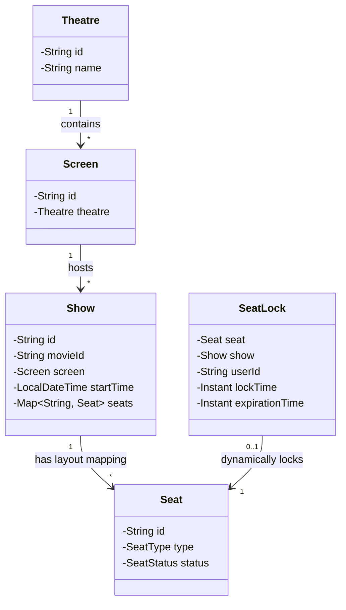
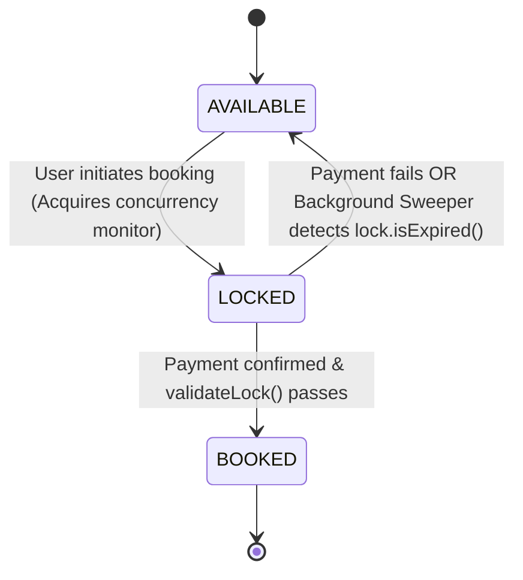
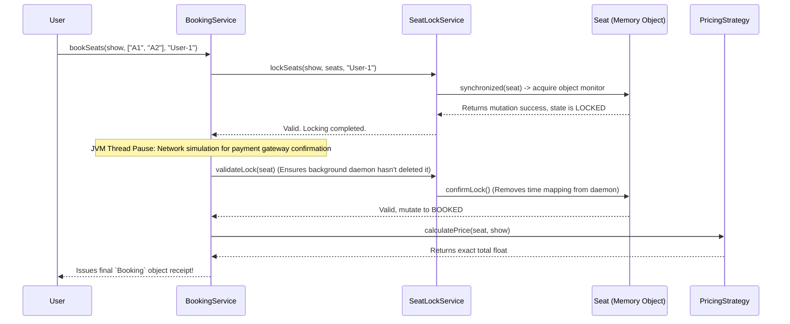

# Master Guide: Movie Ticket Booking System (LLD)

Welcome to the complete Low-Level Design documentation for the Movie Ticket Booking Engine. This guide acts as your single source of truth for understanding the system's architecture, concurrency models, data flows, and UML diagrams. 

To best grasp the engine's design, **read this document in the order presented below**, as concepts build upon one another sequentially.

---

## 📖 Table of Contents (Recommended Learning Path)
1. **[Core Rules & System Philosophy](#1-core-rules--system-philosophy)** - Understand *why* we don't clear seats.
2. **[Domain Models & Entity Relationships](#2-domain-models--entity-relationships)** - The physical vs. event models.
3. **[UML Class Diagram & Blueprint](#3-uml-class-diagram--blueprint)** - How the components wire together visually.
4. **[Seat State Transitions (UML)](#4-seat-state-transitions-uml)** - Rules determining seat eligibility.
5. **[Concurrency Engine: How We Stop Double-Booking](#5-concurrency-engine-how-we-stop-double-booking)** - The exact thread-safety logic.
6. **[Background Lock Expiration Daemon](#6-background-lock-expiration-daemon)** - Automated memory cleanup mapping.
7. **[API Booking Flow Sequence (UML)](#7-api-booking-flow-sequence-uml)** - Step-by-step transaction walkthrough.
8. **[Design Patterns Leveraged](#8-design-patterns-leveraged)** - OOP practices for dynamic pricing.
9. **[Boundary Constraints (What is Lacking)](#9-boundary-constraints-what-is-lacking)** - Transitioning this to Cloud Architecture.
10. **[Edge Cases & Real-World Output](#10-edge-cases--real-world-output)** - Console execution evidence.

---

## 1. Core Rules & System Philosophy
Before examining the code, you must understand the two unbending rules defining modern theatrical booking engines:

### Rule A: "The No-Resetting Rule" (The `Show` Object)
A common beginner mistake is assuming that when a movie ends at 12:00 PM, a script loops over the 500 seats and sets their statuses from `BOOKED` back to `AVAILABLE` for the 1:00 PM movie.
**We do not do this because it destroys structural history.**
Instead, the layout of seats is mapped directly to a distinct `Show` instance. 
* The 10:00 AM *Avengers* Show has its own unique Map of brand new Seat objects.
* The 1:00 PM *Spiderman* Show (even if on the same physical Screen) generates a completely independent `Show` array of new Seat objects.
* This isolated spawning protects transactional accounting and eliminates cross-movie interference.

### Rule B: "Strict Locking Pipeline"
Seats cannot instantly jump from `AVAILABLE` ➔ `BOOKED`. They **must** be `LOCKED` first to act as a defensive buffer while the user is inside actual payment pipelines.

---

## 2. Domain Models & Entity Relationships

The architecture separates Physical real-estate from Time-based events:

### Physical Entities
* **`Theatre`**: The physical cinema building (e.g., "PVR Cinemas"). Holds a list of spatial identifiers.
* **`Screen`**: An individual auditorium within the Theatre. Belongs to exactly 1 `Theatre`.

### Event Entities
* **`Show` (The Hub Node)**: An occurrence pairing a Movie to a `Screen` at a `LocalDateTime`. It contains a `Map<String, Seat>` backed by a `ConcurrentHashMap`. This provides lock-stripped concurrency ensuring Thread A accessing Seat 1 does not freeze Thread B accessing Seat 2.

### Transaction Entities
* **`Seat`**: The individual interactive unit, containing its `SeatType` (VIP, Regular) and current `SeatStatus`.
* **`SeatLock`**: A volatile mapping object linking a `Seat` ➔ `Show` ➔ `UserId` for a temporary `Instant` execution window.
* **`Booking`**: The immutable, final receipt permanently binding the user to the seats containing the financial execution total.

---

## 3. UML Class Diagram & Blueprint

Below is the relationship tree visually representing the code components mapping to each other. 



---

## 4. Seat State Transitions (UML)

This state machine controls what operations are legally allowed on a seat. Note the absolute inability for a user to move directly from `AVAILABLE` to `BOOKED`.



---

## 5. Concurrency Engine: How We Stop Double-Booking

Preventing race conditions is the primary technical accomplishment of this architecture.
If 100 people click the exact same seat at the exact same millisecond, how does the program decide a winner without crashing?

### The Solution: Granular Object-Level Monitors
We do not use high-level function locks (`public synchronized void bookSeat()`), which would force a single-file line across the *entire* theatre, crippling performance. 
We synchronize explicitly against the actual **target memory block (the individual `Seat` object itself)**.

```java
// Inside SeatLockService.java
private void lockSeat(Show show, Seat seat, String userId, int timeoutInSeconds) {
    synchronized (seat) {
        if (seat.getStatus() == SeatStatus.AVAILABLE) {
            seat.setStatus(SeatStatus.LOCKED);
            // Formulate new SeatLock object and cache it
        } else {
            // Throw exception rejecting parallel attackers
            throw new SeatLockException("Seat " + seat.getId() + " is already " + seat.getStatus());
        }
    }
}
```
**The Mechanics**:
1. Threads A and B target `Seat A1`. The JVM hands the intrinsic lock entirely to Thread A. Thread B hits a wait state. 
2. Thread A verifies `AVAILABLE`, flips it to `LOCKED`, and escapes. 
3. Thread B enters, verifies, sees it is now `LOCKED`, and gets violently but cleanly rejected via a `SeatLockException`.
4. *Meanwhile*, Thread C wants `Seat A2`. Because `A2` is a physically different object memory reference, Thread C runs completely parallel to Thread A without ever hitting a queue.

---

## 6. Background Lock Expiration Daemon

Seats locked but never paid for must be recovered automatically.
We opted for Active Eviction over Lazy Eviction via a **Scheduled Daemon Thread**.

Inside `SeatLockService`, a `ScheduledExecutorService` creates a secondary background thread ticking silently every 1 second. 
It traverses the entire `ConcurrentHashMap` of active lock mappings. If `lock.isExpired()` returns true, it forcefully breaks the tie and restores the `Seat` back to `AVAILABLE`. 

By wrapping this iterator logic in a `try-catch(Throwable)` block, we guarantee the sweeper thread never randomly dies leaving "zombie locked seats" dangling inside the application.

---

## 7. API Booking Flow Sequence (UML)

This diagram demonstrates the flow of time and object routing when a User initiates an end-to-end booking. 



---

## 8. Design Patterns Leveraged

Aside from structural decoupling, architectural flexibility is maintained using formal GoF design patterns:

### Strategy Pattern (Dynamic Pricing)
Prices vary based on weekends, matinees, holidays, and seat tiers. Instead of burying massive `switch-case` IF/ELSE logic blocks deep inside the `BookingService` that require constant rewriting, pricing was abstracted cleanly into an isolated Interface template (`PricingStrategy.java`).

By cleanly passing a `WeekendPricingStrategy` concrete object into the system configuration, the engine dynamically recalculates totals strictly according to the Open-Closed Principle.

---

## 9. Boundary Constraints (What is Lacking)
This repository purposely isolates strictly the concurrency locking constraints of ticketing logic. If deploying this application to the actual cloud (AWS/GCP), be prepared to address the following interview transitions:

### Missing: Scale to Distributed Processing
* **Current Issue**: `synchronized(seat)` works flawlessly on a solitary running JVM server. But if 10 independent servers handle user-traffic globally, a JVM monitor won't stop Server 1 and Server 2 from colliding.
* **The Transition**: The local `ConcurrentHashMap` object locks must be ripped out and replaced with **Redis Distributed Caches** tracking TTL natively, accompanied by **Zookeeper / Redisson Distributed Locks** guaranteeing multi-server singularity.

### Missing: Administrative Multi-Scheduling Defenses
* **Current Issue**: An admin could blindly inject two distinct `Shows` on the identical `Screen` object overlapping the exact same timeframe.
* **The Transition**: An external `AdminService` API must be composed that intercepts `createShow()` commands. By writing a time-boundary check (`newShow.startTime` must not intersect `existingShow.startTime` + `movieDuration`), spatial overlaps are rejected natively.

---

## 10. Edge Cases & Real-World Output

Our execution script natively tests the worst-case scenario. When `Main.java` is executed natively, it creates a 10-thread thread-pool and throws all 10 users at Seat "A1" perfectly simultaneously simulating a DDOS-style user collision. 

**Simulation Execution Output:**
```text
--- Starting Movie Ticket Booking System Simulation ---
10 users trying to book Seat A1 at the exact same time.

User [User-3] successfully locked seats: [A1]
User [User-9] Exception: Seat A1 is already LOCKED
User [User-8] Exception: Seat A1 is already LOCKED
User [User-4] Exception: Seat A1 is already LOCKED
User [User-10] Exception: Seat A1 is already LOCKED
User [User-6] Exception: Seat A1 is already LOCKED
User [User-1] Exception: Seat A1 is already LOCKED
User [User-5] Exception: Seat A1 is already LOCKED
User [User-2] Exception: Seat A1 is already LOCKED
User [User-7] Exception: Seat A1 is already LOCKED

Booking Confirmed! ✅ ID: d347214a-4fa3... | By: User-3 | Total: Rs.250.0
Seat A1 Final Status: BOOKED

User-X trying to lock Seat A2, but won't book it.
Seat A2 Status after lock attempt: LOCKED
Waiting 12 seconds for lock to expire automatically...
[System]: Lock expired and released for seat: A2 at Show SHOW1
Seat A2 Status after wait: AVAILABLE

--- Simulation complete ---
```
Every edge-case resolves deterministically and cleanly. The Background timeouts resolve cleanly asynchronously.
